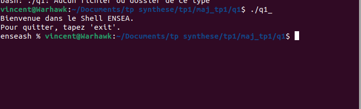
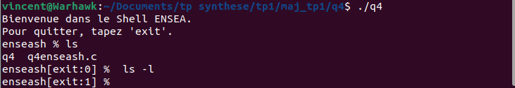
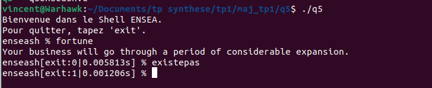
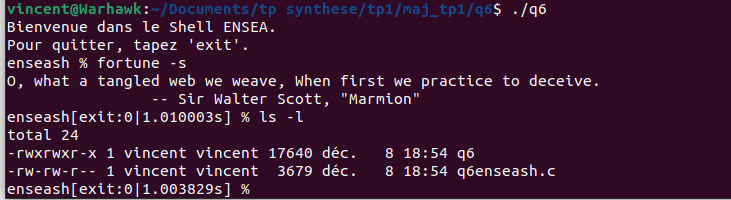
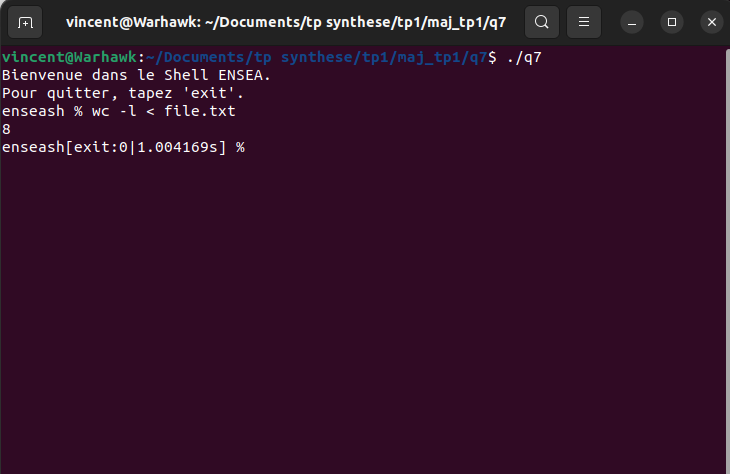

# TP1 : Programmation système			Vincent LAKHMECHE	

## Rapport d'étonnement : Ensea in the Shell

### Objectif : Réaliser un micro shell, affichant les codes de sortie et les temps d’exécution des programmes lancés

#### Les derniers fichiers de code après mise au propre se trouvent dans le répertoire "maj_tp1" . Les répertoires  contenus dans le repository github sont les codes réalisés au cours de la séance. 

#### Le répertoire "maj_tp1" est le répertoire à regarder car c'est dans celui-ci que le code est factorisé, et que j'ai déclaré, les variables qui sont en double, en tant que  variables globales dans l'optique de les réutiliser si je voulais appeler toutes les fonctions des questions précédentes.

#### Q1/2)

L'objectif de cette question est d'implémenter une première fonctionnalité :

​	 -Lorsque le shell est lancé, il affiche un message de bienvenue et un prompt simple, invitant l'utilisateur à entrer des commandes. 

L'intérêt de cette fonctionnalité est dual : créer une atmosphère conviviale et informer l'utilisateur du fonctionnement du shell pour une interaction facilité.

Le micro shell prend en charge l'exécution de commandes simples sans argument. Il lit la commande saisie, l'exécute, puis retourne au prompt  pour attendre la commande suivante.

#### Q3) 

Le micro shell gère la sortie du shell avec la commande "exit" ou en utilisant <ctrl>+d. Lorsque l'utilisateur entre "exit", le shell affiche un message de départ et se termine.

#### Q4) 

Le shell affiche le code de retour (ou le signal) de la commande  précédente dans le prompt, offrant ainsi à l'utilisateur une visibilité  immédiate sur le résultat de l'exécution.

#### Q5)

Le micro shell mesure le temps d'exécution de chaque commande à l'aide  de l'appel clock_gettime, fournissant des informations sur la durée de  l'exécution dans le prompt.

#### Q6) 

Le micro shell prend en charge l'exécution de commandes complexes avec  des arguments, offrant ainsi une flexibilité accrue à l'utilisateur.

#### Q7) 

Le micro shell permet la gestion des redirections vers stdin et stdout  avec les opérateurs '<' et '>'. Cela offre à l'utilisateur la  possibilité de manipuler les flux de données à sa convenance.

Ci-dessous je teste la redirection sur un fichier qui contient 8 lignes avec la commande 'wc -l < file.txt' :

#### En conclusion, le micro shell enseash offre maintenant une interface utilisateur conviviale et des fonctionnalités avancées pour l'exécution de commandes en ligne de commande. 

#### Ce projet m'a permis d'approfondir les bases que j'avais en C++ et en C, plus spécifiquement mes  connaissances en programmation système, gestion des processus, gestion  des signaux et manipulation des fichiers.

#### L'expérience acquise lors de  la réalisation de ce projet a renforcé ma compréhension des concepts  fondamentaux liés au développement d'un shell.

